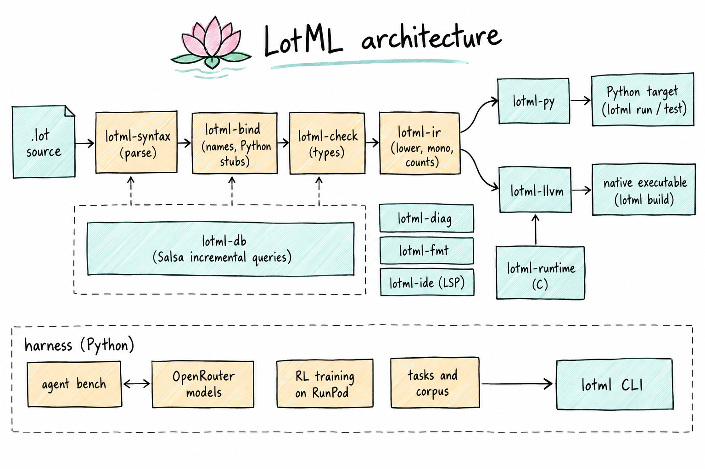

<p align="center">
  
</p>

<h1 align="center">
  
  LotML
</h1>

<p align="center">
  <strong>A programming language designed to be written by LLMs and reviewed by people.</strong>
</p>

<p align="center">
  <a href="https://protonspy.github.io/lotml/"><strong>protonspy.github.io/lotml</strong></a>
</p>

<p align="center">
  <a href="LICENSE"></a>
  
  
  
  
</p>

---

LotML is a statically typed language with Python's syntax wherever its meaning is Python's — and a
visible difference wherever it is not. Its name is Lot, from Lotus, and ML, from Machine Learning;
its files are `.lot`, and `.lotml` is accepted too. It exists so that coding agents write correct
code more often, and so that the people reviewing that code can trust what they read:

- **Python's vocabulary where the semantics match**, so a model's training prior helps instead of
  misleading it.
- **Static types checkable on prefixes**, while the code is still being written.
- **Errors as values**, not exceptions — every failure path is in the signature.
- **Value semantics** with reference counting: no aliasing surprises.
- **A compiler built as the agent's tool** — `check`, `explain`, `digest`, `show`, an LSP server
  and an MCP server, all answering in versioned JSON.
- **`test` blocks in the language**, reporting the values a failed comparison saw.
- **Two targets from one IR**: CPython for `run` and `test`, native code through LLVM for `build`.

Every design decision is backed by a measurement or a checked source, not an opinion: see
[the study](docs/wiki/pages/llm-oriented-language.md) and the [decision records](docs/adr/).

## A taste

```
fn median(xs: [f64]) -> f64?:
    """The middle value of `xs` once sorted; None when `xs` is empty."""
    if len(xs) == 0:
        return None
    var s = xs
    s.sort()
    mid = len(s) // 2
    if len(s) % 2 == 1:
        return s[mid]
    return (s[mid - 1] + s[mid]) / 2.0

test "median of three":
    assert median([3.0, 1.0, 2.0]) == 2.0
```

`var s = xs` copies — `xs` is never mutated behind the caller's back. `f64?` is an optional the
checker forces you to handle. The full language fits in one example-driven page:
[`reference/lotml.md`](reference/lotml.md).

## The language

Blocks are indented by 4 spaces after a line ending in `:`, comments start with `#`, and every
parameter and return type is annotated; locals are inferred. What reads like Python means what
Python means. The rest is where LotML deliberately differs.

### Types

| Type | Written | Notes |
|---|---|---|
| Integers | `int` (= `i64`), `i8` … `i32`, `u8` … `u64` | Fixed width. Overflow stops the program in every build; `wrapping_add` for modular arithmetic |
| Floats | `f64`, `f32` | `/` always returns `f64`; no other implicit conversion — `1 + 2.0` is a type error |
| Text | `str` | Immutable; f-string format specs are checked against the value's type |
| Collections | `[T]` · `{K: V}` · `{T}` · `(A, B)` | Values: `ys = xs` copies |
| Optional | `T?` | The only type that admits `None`; `x is not None` narrows, `x ?? default` unwraps |
| Result | `T ! E` | A `T` or an error `E`; `fail e` returns the error, `expr?` propagates it |
| Records | `type Point(x: f64, y: f64)` | One line, built positionally or by name, compared field by field |
| Sum types | `type Shape = Circle(r: f64) \| Rect(w: f64, h: f64) \| Empty` | `match` must cover every variant |
| Generics | `fn first[T](xs: [T]) -> T?`, `fn largest[T: Ord](…)` | Bounds name traits |
| Trait objects | `[dyn Show]` | Values of different types sharing a trait |

### Errors are values

```
type ParseErr = Empty | NotNumber(text: str) | Negative(value: int)

fn parse(s: str) -> int ! ParseErr:
    if s == "":
        fail Empty
    n = s.to_int() ?? fail NotNumber(s)
    if n < 0:
        fail Negative(n)
    return n

fn describe(s: str) -> str:
    match parse(s):
        case Ok(n):
            return f"number {n}"
        case Err(NotNumber(text)):
            return f"not a number: {text}"
        case Err(_):
            return "invalid"
```

There is no `raise`, `try` or `except`: a failure is a value of the return type, so every way a
function can fail is in its signature. The program stops only on a broken invariant — an index out
of range, an absent key, overflow, division by zero, a failed `assert`, or `todo()`, which fills any
hole so an unfinished program still compiles.

### Values, not references

Every value — list, dict, record — is copied on assignment and on a call, so nothing changes
behind a reader's back. Only a `var` may be reassigned or mutated, and assigning to an immutable is
a compile error, not a new binding. A function changes its caller's value only when the parameter
says so:

```
fn add_all(inout xs: [int], values: [int]):
    for v in values:
        xs.append(v)

fn consume(sink log: [str]) -> int:
    return len(log)

var xs = [1]
add_all(&xs, [2, 3])         # xs is [1, 2, 3]
n = consume(lines)           # lines can no longer be used
```

Copies are cheap. Native code counts references and copies a value only when it changes while
shared, reusing a cell nobody else holds; the Python target copies where a `var` or an `inout` is
involved ([adr 0008](docs/adr/0008-value-semantics-with-reuse-before-borrowing.md)).

### Methods, traits and concurrency

```
type Counter(count: int)

impl Counter:
    fn bump(inout self):
        self.count += 1

trait Show:
    fn show(self) -> str

impl Show for Counter:
    fn show(self) -> str:
        return f"Counter({self.count})"

fn squares(xs: [int]) -> [int]:
    return parallel([lambda: x * x for x in xs])
```

No classes and no inheritance: methods live in `impl`, shared behaviour in traits. Concurrency is
colorless — `parallel(tasks)` runs each task at once and returns their results in order, with no
`async` to mark and nothing to `await`.

### Left out on purpose

`class`, `def`, `raise`, `try`, `except`, `finally`, `with`, `yield`, decorators,
`async`/`await`, `global`, `nonlocal`, `*args`/`**kwargs`, `isinstance`, `Any`, dunder names, and
truthiness of anything but `bool` — `if` and `while` take only a `bool`.

## Architecture

<p align="center">
  
</p>

The compiler is a Rust workspace, one crate per stage:

| Crate | What it does |
|---|---|
| [`lotml-syntax`](compiler/crates/lotml-syntax/) | The lexer, the syntax tree and a tolerant recursive-descent parser, which also reads a file still being written |
| [`lotml-bind`](compiler/crates/lotml-bind/) | A Python module's stub read as a LotML interface without running Python, and the typeshed stubs lotml carries |
| [`lotml-check`](compiler/crates/lotml-check/) | Types, mutability, exhaustive `match`, results and optionals |
| [`lotml-db`](compiler/crates/lotml-db/) | Salsa incremental queries: a query whose inputs did not change answers from memory |
| [`lotml-ir`](compiler/crates/lotml-ir/) | The one IR every target reads; monomorphization and reference counts for the native target |
| [`lotml-py`](compiler/crates/lotml-py/) | The Python backend and its runtime, and the CPython it runs on |
| [`lotml-llvm`](compiler/crates/lotml-llvm/) | The LLVM backend: native executables and shared libraries with a C header |
| [`lotml-runtime`](compiler/crates/lotml-runtime/) | The C runtime, compiled into every native program |
| [`lotml-diag`](compiler/crates/lotml-diag/) | Diagnostics an agent can act on: stable codes, the alternatives that would have fitted, fixes marked safe or not |
| [`lotml-fmt`](compiler/crates/lotml-fmt/) | The one canonical form |
| [`lotml-ide`](compiler/crates/lotml-ide/) | The questions an editor and an agent ask — definitions, references, types, outlines — and symbol-addressed edits and renames |
| [`lotml`](compiler/crates/lotml/) | The command line, and the LSP and MCP servers over `lotml-ide` |

One lowering turns the checked program into one IR, which both targets read
([adr 0020](docs/adr/0020-one-ir-between-the-checker-and-every-backend.md)). `run` and `test` use
the Python target, which reaches every Python library; `build` makes a native executable, or with
`--shared` a library C calls, through LLVM, and a native program runs without Python
([adr 0025](docs/adr/0025-two-targets-python-for-run-llvm-for-build.md)). Generics stay generic
until the native target asks for them, and reference counting exists only there. Every target is
held to the same parity suite. [The pipeline, narrated](docs/codewiki/compiler-pipeline.md) says
where each step lives.

### Interop

- **Python** — a module is imported by its origin, and its interface is generated from its type
  stub when it is imported: `from py.textwrap import dedent`, then `text = dedent(raw)?`. Every
  call into Python returns `T ! PyError`, since any of them can fail. Classes cross as nominal
  handles, overloads as ordered signatures, type variables as type parameters
  ([adr 0029](docs/adr/0029-foreign-modules-are-imported-by-origin-and-their-interfaces-generated.md),
  [adr 0032](docs/adr/0032-a-python-module-is-bound-at-check-time-from-stubs-read-in-rust.md)).
  A project's dependencies come from its `uv.lock`.
- **C, calling in** — a C library is imported from a hand-written interface,
  `bindings/c.<library>.lotmli`: `from c.m import cos`.
- **C, calling out** — `lotml build --shared` exports the functions whose signatures C can call,
  with a generated header and no new syntax
  ([adr 0024](docs/adr/0024-c-abi-exports-chosen-by-signature-without-new-syntax.md)).

### The compiler as the agent's tool

Diagnostics, test reports and runs answer in versioned JSON with `--json`, and every error has a
stable code.

| Command | What it answers |
|---|---|
| `lotml check [--json] [--prefix] [--fix] [--since REV]` | Syntax, type and mutability errors; `--prefix` says whether a half-written file can still be completed |
| `lotml explain E0204` | What an error code means and how to fix it |
| `lotml digest <paths>` | The types and documented signatures of a project, without bodies |
| `lotml show <symbol> <paths>` | A symbol as written, and the functions and types it uses |
| `lotml fmt [--check] <paths>` | The canonical form |
| `lotml test [--json]` | The `test` blocks, with the values a failed comparison saw |
| `lotml bind <module>` | The interface of a Python module, or why it has none |
| `lotml lsp` · `lotml mcp` | The Language Server Protocol, and the same tools over MCP |
| `lotml init` | `AGENTS.md`, the guide and the MCP server set up for Claude Code, Codex or Cursor |

## Getting started

[Releases](https://github.com/protonspy/lotml/releases) hold `lotml` built for Linux (x86_64),
Windows (x86_64) and macOS (Apple silicon): each archive holds the binary, this README and the
licence and the pinned uv with its licences, beside the VS Code extension's `.vsix` and a
`SHA256SUMS`. The binary carries its runtimes, and a native build needs `clang` 17 or later.

To build it instead, with Rust 1.97+:

```bash
cargo build --manifest-path compiler/Cargo.toml --locked --release -p lotml
```

```bash
lotml check stats.lot       # syntax, type and mutability errors
lotml test  stats.lot       # run the test blocks
lotml run   main.lot        # run fn main()
lotml build stats.lot       # compile to a native executable, through LLVM
lotml build --shared stats.lot          # or to a shared library and its C header
lotml build --target python stats.lot   # or to a Python module with its runtime
lotml init                  # set a project up for coding agents: AGENTS.md, guide, MCP server
lotml explain E0204         # explain an error code
```

### Which Python runs

`run` and `test` need no Python of yours: lotml runs CPython 3.14 through the uv beside it, and
the first run downloads it once, saying from where. The interpreter is, in order:

1. `LOTML_PYTHON`;
2. for `run` and `test`, the project's virtual environment (`VIRTUAL_ENV`, else its `.venv`);
3. the CPython 3.14 uv already installed;
4. a download of it through uv;
5. with no uv, `python3`, `python` or `py -3` on the path.

A uv lotml finds but will not run is an error naming why, never a fallback to the path.
`--offline` (or `LOTML_OFFLINE=1`) never downloads, failing instead with what is missing, and
`run --json` and `test --json` record the interpreter's path and version and uv's version. uv runs
from lotml's own cache with its configuration files ignored, so a project's `uv.toml` or
`.python-version` changes neither the interpreter uv gives nor where it comes from
([adr 0026](docs/adr/0026-lotml-ships-uv-and-runs-python-3-14-by-default.md)).

### Editors

The VS Code extension in [`editors/vscode/`](editors/vscode/) gives LotML files the lotus icon and
starts the language server for them; its README says how to build and install it. On Windows, the
same icon marks LotML files in Explorer for the current user, with no administrator needed:

```powershell
powershell -ExecutionPolicy Bypass -File editors\windows\register.ps1   # -Remove takes it back
```

The tree-sitter grammar is in [`reference/`](reference/).

## Repository

| Path | What lives there |
|---|---|
| [`compiler/`](compiler/) | The Rust compiler: the crates above |
| [`reference/`](reference/) | The language reference and the tree-sitter grammar |
| [`editors/`](editors/) | The file icon, its Windows Explorer association and the VS Code extension |
| [`harness/`](harness/) | The evaluation harness that measures models writing LotML |
| [`research/`](research/) | Reproducible experiments: token cost, Python leakage, editing robustness |
| [`docs/`](docs/) | Knowledge base: wiki, ADRs, glossary, stack |
| [`plans/`](plans/) · [`specs/`](specs/) | The roadmap and the feature specs it is built from |

## Development

```bash
uv --directory harness run pytest
cargo test --manifest-path compiler/Cargo.toml
cargo clippy --manifest-path compiler/Cargo.toml --locked --all-targets -- -D warnings
```

The project is spec-driven; `CLAUDE.md` and `.claude/rules/` describe the workflow. The design
rests on 83 papers, each quote checked verbatim against its source: the list is
[`research/literature/sources.json`](research/literature/sources.json), and how the check works is
[source verification](docs/wiki/pages/source-verification.md).

## License

[MIT](LICENSE)
